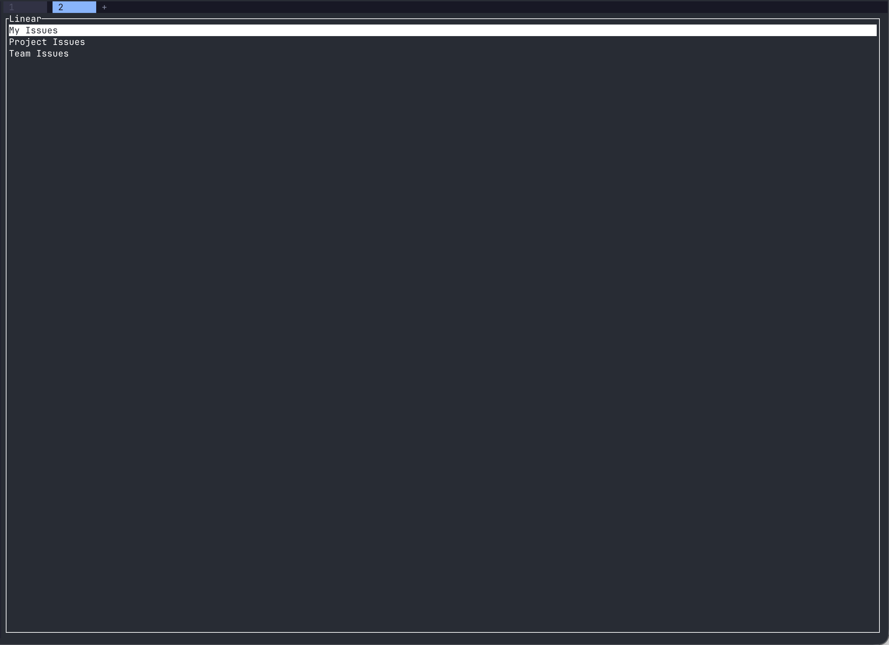
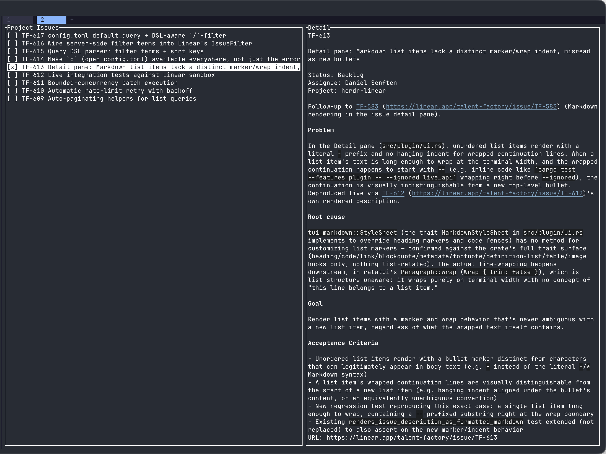

# Herdr Linear

[](#license)
[](https://github.com/talent-factory/herdr-linear/issues)

A **pure Rust** client for [Linear.app](https://linear.app)'s GraphQL API. Designed as a plugin for [Herdr](https://herdr.dev), with zero dependencies on Node.js or TypeScript.

## Features

✅ **Full GraphQL API Coverage**
- Query teams, issues, projects, cycles, and workflow states
- Create and update issues
- Add comments to issues
- Paginated queries with cursor support

✅ **Type-Safe**
- Fully typed models matching Linear's schema
- Compile-time error checking

✅ **Async/Await**
- Built on tokio for high-performance async operations
- Non-blocking I/O throughout

✅ **Error Handling**
- Comprehensive error types with context
- Automatic rate-limit retry with backoff (opt-out available)

✅ **Logging**
- Structured logging with tracing
- Debug-level operation tracking

## Quick Start

### Installation

Add to your `Cargo.toml`:

```toml
[dependencies]
herdr-linear = { path = "../herdr-linear" }
tokio = { version = "1", features = ["full"] }
```

### Basic Usage

```rust
use herdr_linear::LinearClient;

#[tokio::main]
async fn main() -> Result<(), Box<dyn std::error::Error>> {
    // Create client with API key
    let api_key = "lin_api_YOUR_KEY_HERE";
    let client = LinearClient::new(api_key)?;

    // Get authenticated user
    let viewer = client.get_viewer().await?;
    println!("Authenticated as: {}", viewer.name);

    // Get all teams
    let teams = client.get_teams(Some(50), None).await?;
    for team in teams.nodes {
        println!("Team: {} ({})", team.name, team.key);
    }

    // Get issues for a team
    let issues = client.get_team_issues("team_id", Some(20)).await?;
    for issue in issues.nodes {
        println!("Issue: {} - {}", issue.identifier, issue.title);
    }

    // Create an issue
    let new_issue = client
        .create_issue("New feature", "team_id", Some("Description here"), Some(2))
        .await?;
    println!("Created: {}", new_issue.identifier);

    Ok(())
}
```

### Get Linear API Key

1. Go to [Linear Settings](https://linear.app/settings/api)
2. Create a Personal API key
3. Copy the key (format: `lin_api_*`)
4. Set as environment variable: `export LINEAR_API_KEY=lin_api_your_key`

## API Methods

### User & Authentication

```rust
client.get_viewer().await?  // Get current authenticated user
```

### Teams

```rust
client.get_teams(limit, after).await?           // List one page of teams
client.get_team("team_id").await?               // Get single team
client.get_team_issues("team_id", limit).await? // Get team's issues (one page)
client.get_all_teams(options).await?            // Fetch every team, auto-paginated
```

### Issues

```rust
client.get_issues(filter, limit, after).await?  // List one page of issues (with optional filter)
client.get_issue("issue_id").await?             // Get single issue
client.create_issue(title, team_id, description, priority).await?  // Create issue
client.update_issue("issue_id", updates).await? // Update issue
client.add_comment("issue_id", "body").await?   // Add comment to issue
client.get_all_issues(filter, options).await?   // Fetch every matching issue, auto-paginated
client.get_all_team_issues("team_id", options).await? // Fetch every issue for a team, auto-paginated
```

### Projects & Cycles

```rust
client.get_projects(filter, limit, after).await? // List one page of projects
client.get_cycles("team_id", limit).await?      // Get team's cycles
client.get_workflow_states("team_id").await?    // Get team's workflow states
client.get_all_projects(filter, options).await? // Fetch every matching project, auto-paginated
```

### Auto-Pagination

The `get_all_*` methods above transparently page through their single-page
counterparts, following the API's cursor until every result has been
fetched. Configure page size and safety caps via `PaginationOptions`
(defaults: page size 50, max 100 pages, max 10,000 items — a call that
would exceed either cap returns `Error::InvalidRequest` instead of looping
or silently truncating):

```rust
use herdr_linear::PaginationOptions;

// Defaults are fine for most cases:
let all_issues = client.get_all_issues(None, PaginationOptions::default()).await?;

// Tune page size and/or safety caps as needed:
let options = PaginationOptions::default()
    .with_page_size(100)
    .with_max_pages(500)
    .with_max_items(50_000);
let all_projects = client.get_all_projects(None, options).await?;
```

### Raw Queries

```rust
// Execute raw GraphQL query
let response = client.query::<MyType>(query_string, variables).await?;

// Execute raw GraphQL mutation
let response = client.mutate::<MyType>(mutation_string, variables).await?;
```

### Rate Limiting

When Linear rejects a request as rate-limited — an HTTP 400 response with a `RATELIMITED`
GraphQL error code (Linear's [documented signal](https://linear.app/developers/rate-limiting)),
or a plain HTTP 429 as a defense-in-depth fallback — `LinearClient` automatically waits and
retries, up to 3 total attempts, before giving up. It waits the server's `Retry-After` value
when present, falling back to exponential backoff (500ms, then 1s — the default 3-attempt
budget only ever exercises these first two steps) otherwise, with either wait capped at 60s.
If the retry budget is exhausted, the original `Error::RateLimitExceeded` is still returned,
unchanged.

This is designed to smooth over brief bursts against Linear's rate limiter, not to wait out a
genuinely exhausted hourly quota — Linear's quotas (5,000 requests/hour for API keys) reset on
an hourly cadence far longer than this retry budget can cover.

Retry is on by default; opt out for the old fail-fast behavior:

```rust
let client = LinearClient::new(api_key)?.with_rate_limit_retry(false);
```

## Project Structure

```
herdr-linear/
├── src/
│   ├── lib.rs              # Library root
│   ├── main.rs             # Example usage & CLI entry
│   ├── client.rs           # LinearClient implementation
│   ├── models.rs           # Type definitions
│   ├── queries.rs          # GraphQL query strings
│   └── error.rs            # Error types
├── benches/                # Performance benchmarks (cargo bench)
├── Cargo.toml
└── README.md
```

## Environment Variables

```bash
# Required
export LINEAR_API_KEY=lin_api_your_key_here

# Optional - Enable debug logging
export RUST_LOG=herdr_linear=debug
```

## Development

### Building

```bash
cd ~/GitRepository/herdr-linear
cargo build
```

### Running Examples

```bash
export LINEAR_API_KEY=lin_api_your_key
export RUST_LOG=debug

cargo run --example tracing_demo
```

### Running Tests

```bash
cargo test
```

### Running Benchmarks

Performance baselines for pagination, batch execution, and rate-limit-retry
overhead, run against a mocked backend:

```bash
cargo bench
# or
just bench
```

Not part of `cargo test`/CI — a local/manual tool for catching regressions
before they ship. See [`benches/README.md`](benches/README.md) for what
each benchmark measures and how to read the numbers.

### Logging

The crate uses `tracing` for structured logging. Enable with environment variables:

```bash
# Debug level for herdr-linear
export RUST_LOG=herdr_linear=debug

# All debug logs
export RUST_LOG=debug

# JSON output
RUST_LOG=info cargo run --example tracing_demo 2>&1 | jq
```

## Error Handling

All errors are of type `herdr_linear::Error`:

```rust
use herdr_linear::Error;

match client.get_viewer().await {
    Ok(user) => println!("User: {}", user.name),
    Err(Error::AuthenticationFailed(msg)) => eprintln!("Auth failed: {}", msg),
    Err(Error::RateLimitExceeded { retry_after_ms }) => {
        // Only reached once the automatic retry budget is exhausted (see
        // "Rate Limiting" above), or when retry was opted out of.
        eprintln!("Rate limited, retry after {}ms", retry_after_ms);
    }
    Err(e) => eprintln!("Error: {}", e),
}
```

## Herdr Plugin

`herdr-linear` also ships as a [Herdr](https://herdr.dev) plugin: a "My Issues"
panel you can open as a split pane or a tab from inside a Herdr session. Browsing
issues is read-only; pressing `<Enter>` on a selected issue is not — see "Use" below.

### Requirements

Requires **herdr >= 0.8.0** (see `min_herdr_version` in `herdr-plugin.toml`). herdr's own
`agent`/`pane`/`tab` CLI surface has changed shape between releases before (TF-604, TF-624) —
this plugin has only ever been verified against 0.8.0; an older installed herdr will fail with
`herdr config check`-style "unknown option"/"unknown subcommand" errors rather than a plugin bug.
Run `herdr --version` to check yours, and `herdr update` to upgrade.

<table>
<tr>
<td width="33%">

**Menu**



</td>
<td width="33%">

**Issue detail**



</td>
<td width="33%">

**Implement on `<Enter>`**


</td>
</tr>
</table>

### Install

```bash
herdr plugin install talent-factory/herdr-linear
```

This downloads a checksum-verified prebuilt binary for your platform (macOS
arm64/x86_64, Linux x86_64, or Windows x86_64) when one is published for the
installed version, falling back to compiling from source with `cargo` otherwise
(which does require a Rust toolchain).

For local development, use `herdr plugin link /path/to/herdr-linear` instead.

### Configure

Set your Linear API key in the plugin's config file:

```bash
mkdir -p "$(herdr plugin config-dir herdr-linear)"
echo 'api_key = "lin_api_your_key_here"' > "$(herdr plugin config-dir herdr-linear)/config.toml"
```

Or export `LINEAR_API_KEY` in the environment Herdr runs in.

If "Project Issues" can't match your repo to a Linear project by name (see "Use" below),
add a repo-scoped override to the same `config.toml`:

```toml
[project_overrides]
"your-repo-name" = "linear-project-id"
```

This file is shared by every repo/workspace that opens this plugin's panel (there's one
`config.toml` per plugin *installation*, not per repo), so `project_overrides` is a table
keyed by repo name rather than a single value — an entry for one repo never affects how
another repo resolves. You don't need to work out the repo name or project id yourself:
pressing `c` (from any screen — see "Use" below) opens this file, creating it if it doesn't
exist yet; error screens' text itself shows the exact snippet to paste in, with your repo
name already filled in.

Optionally set `agent_command` in the same `config.toml` to choose the coding agent started
when you implement an issue (see "Use" below). If set, it **always** wins. If unset, the
plugin looks at your other open herdr tabs and reuses whatever coding agent you're already
running there; if none are open either, it falls back to `"hr"`, a personal shell alias — it
won't exist for other users, so either set `agent_command` yourself or define an `hr`
alias/function in your shell.

(Earlier versions preferred the other-open-tabs guess over an explicit `agent_command`. That
was reversed: herdr's tab list can only report the underlying binary a pane runs — e.g.
`"claude"` — never the alias that launched it, so a pane started via `hr` looks identical to
one started bare. Under the old precedence, `agent_command = "hr"` could never actually take
effect once any other Claude Code tab was open.)

`c` tries to open `config.toml` in `nvim`, inside a herdr pane, so it's usable over SSH (e.g.
herdr on an iPad) where there's no GUI to hand the file to. Set `editor` in the same
`config.toml` to use a different command instead (a bare binary name, no flags — e.g.
`editor = "vim"`); it's launched the same way, inside a herdr pane. If neither `nvim` nor an
`editor` override is available, or the herdr pane couldn't be opened, `c` falls back to your
OS's default handler for `.toml` files — today's original behavior. Repeated `c` presses reuse
the same editor pane rather than opening a new one each time.

"Team Issues" shows a Linear team's open issues. Unlike a project, a team has no
repo-derived name to match, so it needs an explicit default: set `team_id` in the same
`config.toml`.

```toml
team_id = "linear-team-id"
```

You only need this if your workspace has more than one team — a single-team workspace
resolves automatically. If `team_id` is unset and the workspace has more than one team,
entering "Team Issues" shows an error naming every team (so you can see which id to use)
and pointing at `config.toml`; press `c` on that error screen to open it, same as for the
project-matching errors above.

Every view supports a small query DSL, both as a default applied on entry and as a live
`/`-filter over whatever's currently loaded. Free text still does a plain
case-insensitive substring match against title/identifier, exactly as before; alongside
it, `priority:`/`state:`/`label:` narrow by those fields and `sort:` orders the result
(prefix a field with `-` for descending — e.g. `sort:-priority,updated`):

| Term | Matches |
| --- | --- |
| `priority:2`, `priority:high` | Exact priority (`0`=none, `1`=urgent, `2`=high, `3`=medium, `4`=low) |
| `priority:>=2`, `priority:<=2` | Priority at least/at most the given level |
| `state:"In Review"` | Workflow state, by name (case-insensitive; quote multi-word names) |
| `label:bug` | Has a label with this name (case-insensitive) |
| `sort:priority`, `sort:-updated` | Order by `priority`/`updated`/`created`/`identifier` |

Set a default for every view with `default_query` in `config.toml`:

```toml
default_query = "priority:>=2 sort:-priority"
```

Pressing `/` on a loaded view opens its own filter, parsed through the same DSL — it
fully replaces `default_query` for that view rather than narrowing further on top of it,
matching how `/`-filter already worked before this DSL existed. `Enter` confirms,
`Esc` clears it and restores `default_query`'s view.

### Use

Bind keys to the plugin's actions in `~/.config/herdr/config.toml`:

```toml
[[keys.command]]
key = "prefix+l"
type = "plugin_action"
command = "herdr-linear.open-split"
description = "Open Linear panel"

[[keys.command]]
key = "prefix+shift+l"
type = "plugin_action"
command = "herdr-linear.open-tab"
description = "Open Linear panel (tab)"
```

**On Windows**, bind `herdr-linear.open-split-windows` / `herdr-linear.open-tab-windows`
instead — herdr can't spawn the plugin's pane via a relative path on Windows, so the
Windows actions open it differently internally, but behave identically from the
keybinding's perspective.

Reload the config, then press the bound key to open the plugin. The panel opens on a
menu with three options — "My Issues", "Project Issues", and "Team Issues" — all
available. From the menu, use `↑`/`↓` to navigate options,
`Enter` to open the highlighted view, and `q` or `Esc` to quit. Once inside a view,
use `↑`/`↓` to navigate the issue list, `/` to filter it by title or identifier (type to
narrow, `↑`/`↓` still navigate the narrowed list live, `<Enter>` confirms and keeps the
filter applied, `Esc` cancels and restores the full list), `o` to open the selected issue
in your browser, `<Space>` to mark/unmark the selected issue (shown with a `[x]`/`[ ]`
checkbox prefix — independent of the active filter, so a mark survives narrowing and
clearing the filter), `<Enter>` to implement it — with no issues marked, implements just
the selected one; with one or more marked, implements every marked issue in list order,
one after another (each opens a herdr tab, starts the preferred coding agent, sets the
issue to "In Progress", and injects an implement prompt once the agent is ready; the
status banner then summarizes how many started, e.g. "3/4 started", plus a per-issue
message for any that failed or finished with a warning) — `r` to retry after an error,
and `Esc` to return to the menu (or, while filtering, to cancel the filter first). Press
`q` to quit the panel from anywhere (menu or view), and `c` to open `config.toml` from
anywhere — menu, a loading or loaded view, or an error screen (see "Configure" above —
creates the file if it doesn't exist yet). Press `?` from anywhere to open an in-app help
overlay — **What's New** (recent changes),
**Keybindings** (every binding above, plus this one), **Settings** (your currently
resolved `config.toml` values — the API key is shown only as set/not-set, never in the
clear), and **About** (version, repo, license) — without leaving the terminal. Switch
tabs with `Tab`/`←`/`→` or `1`-`4`, scroll with `j`/`k` or the arrow keys, and close with
`Esc`, `q`, or `?` again. Pressing the key again focuses the panel if it's open
elsewhere, or closes it if it's already focused.

> [!NOTE]
> Each issue's agent pane is given a name unique to that issue (the resolved agent
> command plus the issue's identifier, e.g. `hr--tf-579`), not the bare agent command,
> so concurrently running issues stay distinguishable in herdr's own pane/agent list.
> The name is applied by a `herdr agent rename` call *after* the agent has started —
> nothing passes a name at launch — and it's best-effort: if the rename fails, the
> agent keeps running under herdr's own default name and `<Enter>` reports it as a
> warning rather than failing the launch.

> [!NOTE]
> `<Enter>` starts the coding agent in the directory herdr reports as your currently
> focused pane/workspace (via its injected launch context), not the plugin process's
> own working directory — so it resolves correctly whether you opened the panel via
> the **split** action (`herdr-linear.open-split`) or the **tab** one
> (`herdr-linear.open-tab`). This requires herdr ≥ 0.8.0 (see `min_herdr_version` in
> `herdr-plugin.toml`); on an older/misbehaving herdr that omits the launch context,
> it falls back to the plugin's own install directory. If that fallback also fails
> (an unreadable process directory), `<Enter>` sets an actionable status instead of
> silently starting the agent nowhere in particular.

To see what the plugin is doing internally (e.g. while debugging a cwd-resolution or
`herdr` CLI issue), set `HERDR_LINEAR_LOG_FILE` to a file path before launching herdr —
the plugin writes its `tracing` diagnostics there instead of to stdout, which would
otherwise corrupt the TUI:

```bash
export HERDR_LINEAR_LOG_FILE=/tmp/herdr-linear.log
```

## License

Dual-licensed under MIT OR Apache-2.0

## Contributing

Bugs and feature requests: [open an issue on GitHub](https://github.com/talent-factory/herdr-linear/issues).
(Linear is used for internal planning only and isn't publicly accessible.)

1. Fork the repository
2. Create a feature branch: `git checkout -b feature/your-feature`
3. Commit changes: `git commit -am 'Add feature'`
4. Push to branch: `git push origin feature/your-feature`
5. Submit a pull request

See [CONTRIBUTING.md](CONTRIBUTING.md) for the full development workflow.

## Related Projects

- [Herdr](https://herdr.dev) - Task management & productivity platform
- [Linear](https://linear.app) - Issue tracking for software teams
- [Linear SDK (TypeScript)](https://github.com/linear/linear/tree/master/packages/sdk)

## Maintenance

Maintained by [Talent Factory GmbH](https://talent-factory.xyz)

---

**Status**: 🚀 Active Development

Last updated: 2026-08-04
